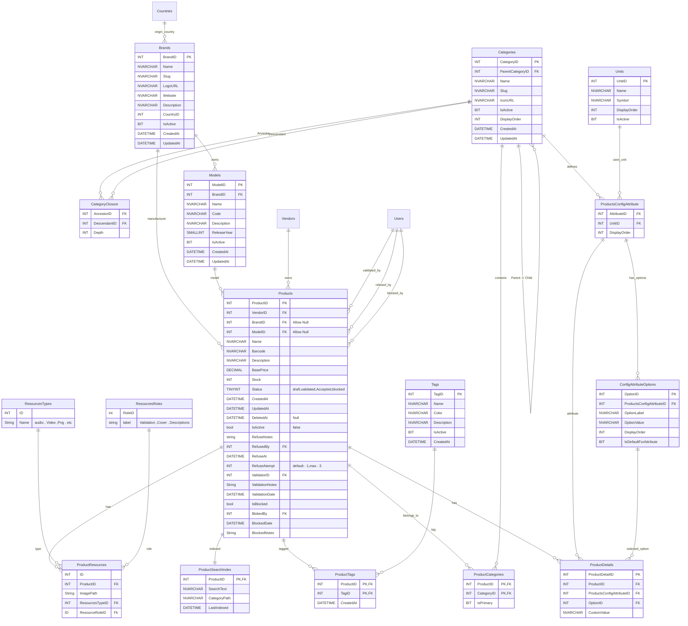

```mermaid
erDiagram

%%====================================================
%% CATEGORIES
%%====================================================

Categories {
    INT CategoryID PK
    INT ParentCategoryID FK
    NVARCHAR Name
    NVARCHAR Slug
    NVARCHAR IconURL
    BIT IsActive
    INT DisplayOrder
    DATETIME CreatedAt
    DATETIME UpdatedAt
}

CategoryClosure {
    INT AncestorID FK
    INT DescendantID FK
    INT Depth
}

ProductsConfigAttribute {
    INT AttributeID FK
    INT UnitID FK
    INT DisplayOrder
}
Units {
    INT UnitID PK
    NVARCHAR Name
    NVARCHAR Symbol
    INT DisplayOrder
    BIT IsActive
}

ConfigAttributeOptions {
    INT OptionID PK
    INT ProductsConfigAttributeID FK
    NVARCHAR OptionLabel
    NVARCHAR OptionValue
    INT DisplayOrder
    BIT IsDefaultForAttribute
}

%%====================================================
%% BRANDS / MODELS
%%====================================================

Brands {
    INT BrandID PK
    NVARCHAR Name
    NVARCHAR Slug
    NVARCHAR LogoURL
    NVARCHAR Website
    NVARCHAR Description
    INT CountryID
    BIT IsActive
    DATETIME CreatedAt
    DATETIME UpdatedAt
}

Models {
    INT ModelID PK
    INT BrandID FK
    NVARCHAR Name
    NVARCHAR Code
    NVARCHAR Description
    SMALLINT ReleaseYear
    BIT IsActive
    DATETIME CreatedAt
    DATETIME UpdatedAt
}

%%====================================================
%% PRODUCTS
%%====================================================

Products {
    INT ProductID PK
    INT VendorID FK
    INT BrandID FK "Allow Null"
    INT ModelID FK "Allow Null"
    NVARCHAR Name
    NVARCHAR Barcode
    NVARCHAR Description
    DECIMAL BasePrice
    INT Stock
    TINYINT Status "draft,validated,Accepted,blocked"
    DATETIME CreatedAt
    DATETIME UpdatedAt
    DATETIME DeletedAt "Null"
    bool IsActive "false"
    string RefuseNotes 
    INT RefusedBy FK
    DATETIME RefuseAt
    INT RefuseAtempt "default : 1,max : 3" 
    INT ValidatorID FK
    String ValidationNotes 
    DATETIME ValidationDate 
    bool IsBlocked 
    INT BlokedBy FK 
    DATETIME BlockedDate
    String BlockedNotes
}
ProductResources {
    INT ID 
    INT ProductID FK
    String ImagePath
    INT ResourcesTypeID FK
    ID ResourceRoleID Fk 
}
ResourcesRoles{
    int RoleID 
    string label "Validation ,Cover , Descriptions"
}
ResourcesTypes {
    INT ID
    String Name "audio , Video ,Png , etc"
}

ProductDetails {
    INT ProductDetailID PK
    INT ProductID FK
    INT ProductsConfigAttributeID FK
    INT OptionID FK
    NVARCHAR CustomValue
   
}

%%====================================================
%% PRODUCT CATEGORIES
%%====================================================

ProductCategories {
    INT ProductID PK,FK
    INT CategoryID PK,FK
    BIT IsPrimary
}

%%====================================================
%% PRODUCT TAGS
%%====================================================

Tags {
    INT TagID PK
    NVARCHAR Name
    NVARCHAR Color
    NVARCHAR Description
    BIT IsActive
    DATETIME CreatedAt
}

ProductTags {
    INT ProductID PK,FK
    INT TagID PK,FK
    DATETIME CreatedAt
}

%%====================================================
%% SEARCH
%%====================================================

ProductSearchIndex {
    INT ProductID PK,FK
    NVARCHAR SearchText
    NVARCHAR CategoryPath
    DATETIME LastIndexed
}

%%====================================================
%% CATEGORY HIERARCHY
%%====================================================

Categories ||--o{ Categories : "Parent -> Child"

Categories ||--o{ CategoryClosure : Ancestor
Categories ||--o{ CategoryClosure : Descendant

%%====================================================
%% CATEGORY ATTRIBUTES
%%====================================================

Categories ||--o{ ProductsConfigAttribute : defines

Units ||--o{ ProductsConfigAttribute : uses_unit

ProductsConfigAttribute ||--o{ ConfigAttributeOptions : has_options

%%====================================================
%% BRANDS / MODELS
%%====================================================

Countries ||--o{ Brands : origin_country

Brands ||--o{ Models : owns

Brands ||--o{ Products : manufacturer

Models ||--o{ Products : model

%%====================================================
%% PRODUCTS
%%====================================================

Vendors ||--o{ Products : owns

Users ||--o{ Products : validated_by

Users ||--o{ Products : refused_by

Users ||--o{ Products : blocked_by

%%====================================================
%% PRODUCT CATEGORIES
%%====================================================

Products ||--o{ ProductCategories : belongs_to

Categories ||--o{ ProductCategories : contains

%%====================================================
%% PRODUCT DETAILS
%%====================================================

Products ||--o{ ProductDetails : has

ProductsConfigAttribute ||--o{ ProductDetails : attribute

ConfigAttributeOptions ||--o{ ProductDetails : selected_option

%%====================================================
%% PRODUCT RESOURCES
%%====================================================

Products ||--o{ ProductResources : has

ResourcesTypes ||--o{ ProductResources : type

ResourcesRoles ||--o{ ProductResources : role

%%====================================================
%% TAGS
%%====================================================

Products ||--o{ ProductTags : tagged

Tags ||--o{ ProductTags : tag

%%====================================================
%% SEARCH
%%====================================================

Products ||--|| ProductSearchIndex : indexed


```