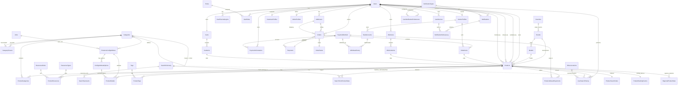

## Database Schema

```mermaid
erDiagram
%%====================================================
%% CATEGORY HIERARCHY
%%====================================================

Categories ||--o{ Categories : "Parent -> Child"

Categories ||--o{ CategoryClosure : Ancestor
Categories ||--o{ CategoryClosure : Descendant

%%====================================================
%% CATEGORY ATTRIBUTES
%%====================================================

Categories ||--o{ ProductsConfigAttribute : defines

Units ||--o{ ProductsConfigAttribute : uses_unit

ProductsConfigAttribute ||--o{ ConfigAttributeOptions : has_options

%%====================================================
%% BRANDS / MODELS
%%====================================================

Countries ||--o{ Brands : origin_country

Brands ||--o{ Models : owns

Brands ||--o{ Products : manufacturer

Models ||--o{ Products : model

%%====================================================
%% PRODUCTS
%%====================================================

Users ||--o{ Products : owns

Users ||--o{ Products : validated_by

Users ||--o{ Products : refused_by

Users ||--o{ Products : blocked_by

%%====================================================
%% PRODUCT CATEGORIES
%%====================================================

Products ||--o{ ProductCategories : belongs_to

Categories ||--o{ ProductCategories : contains

%%====================================================
%% PRODUCT DETAILS
%%====================================================

Products ||--o{ ProductDetails : has

ProductsConfigAttribute ||--o{ ProductDetails : attribute

ConfigAttributeOptions ||--o{ ProductDetails : selected_option

%%====================================================
%% PRODUCT RESOURCES
%%====================================================

Products ||--o{ ProductResources : has

ResourcesTypes ||--o{ ProductResources : type

ResourcesRoles ||--o{ ProductResources : role

%%====================================================
%% TAGS
%%====================================================

Products ||--o{ ProductTags : tagged

Tags ||--o{ ProductTags : tag

%%====================================================
%% SEARCH
%%====================================================

Products ||--|| ProductSearchIndex : indexed

%%====================================================
%% PRODUCT ALLOWED PAYMENTS
%%====================================================

Products ||--o{ ProductAllowedPayements : allows

PaymentMethods ||--o{ ProductAllowedPayements : used_in
%%====================================================
    %% RELATIONSHIPS
    %%====================================================

    Products ||--|| ProductRankingFactors : ranking_factors
    SearchDictionary ||--o{ SearchTermProductStats : tracks
    Products ||--o{ SearchTermProductStats : statistics
    %%====================================================
    %% RELATIONSHIPS
    %%====================================================

    Users ||--o{ UserSearchHistory : performs

    Products ||--o{ UserSearchHistory : clicked

    SearchDictionary ||--o{ SearchSynonyms : canonical_term

    %% Logical relationship (not enforced by FK)
    SearchDictionary ||..o{ UserSearchHistory : matches_NormalizedText
       Products ||--o{ RegionalProductStats : regional_statistics

    IPGeoLocations ||--o{ UserSearchHistory : resolved_location
  Users ||--o{ UserExternalLogins : "has"
OrderItems ||--o| Products : refer
WishListItems ||--o| Products : refer
CartItems ||--o| Products : refer
Users ||--o{ UserRoles : has
Roles ||--o{ UserRoles : assigned
Users ||--o| VendorProfiles : vendor
Users ||--o| CustomerProfiles : customer
Users ||--o| AdminProfiles : admin

Users ||--o{ Addresses : has
Users ||--o{ PaymentInformations : owns
Users ||--o{ WishLists : owns
Users ||--|| Carts : owns
Users ||--o{ Orders : places

WishLists ||--o{ WishListItems : contains
Carts ||--o{ CartItems : contains

Orders ||--|{ OrderItems : contains
Orders }o--|| Payments : payment
Orders }o--|| OrderStatus : status

VendorProfiles ||--o{ BankAccounts : owns
VendorProfiles ||--o{ OrderItems : sells

BankAccounts ||--o{ WithdrawHistory : withdrawals

PaymentMethods ||--o{ Payments : used_by
PaymentMethods ||--o{ WithdrawHistory : withdraw_by
PaymentMethods ||--o{ PaymentInformations : account

Addresses ||--o{ Orders : billing
Addresses ||--o{ Orders : shipping
 Users ||--o{ Notifications : receives
    NotificationTypes ||--o{ Notifications : type

    Users ||--o{ UserDevices : owns

    Users ||--o{ UserNotificationPreferences : configures
    NotificationTypes ||--o{ UserNotificationPreferences : preference

    Notifications ||--o{ NotificationDeliveryLog : delivery
    UserDevices ||--o{ NotificationDeliveryLog : sent_to
```
